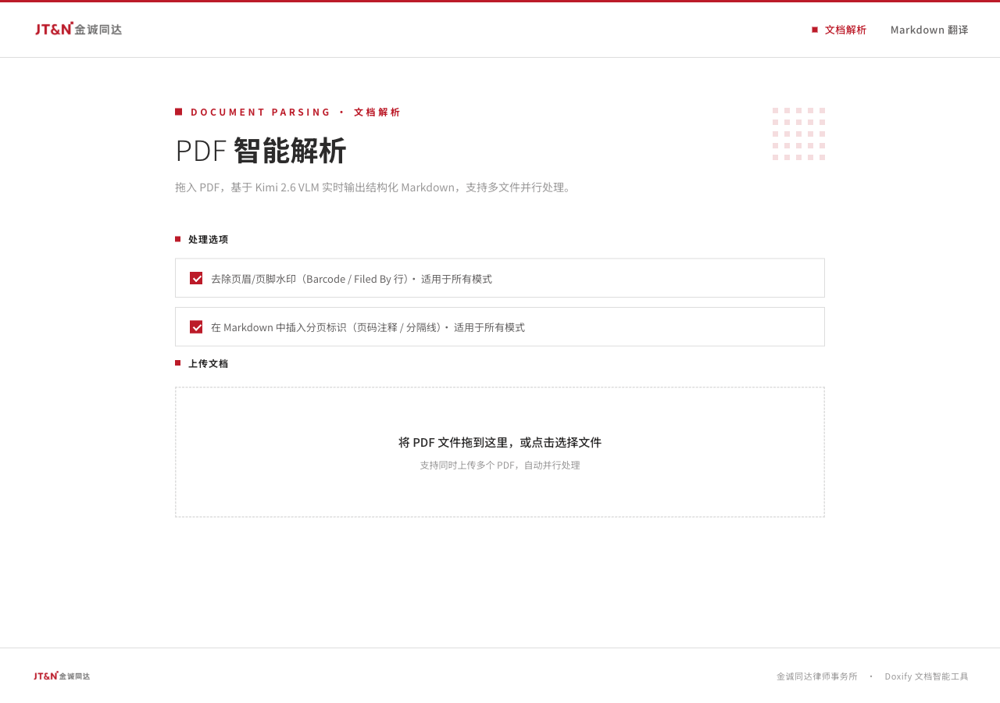
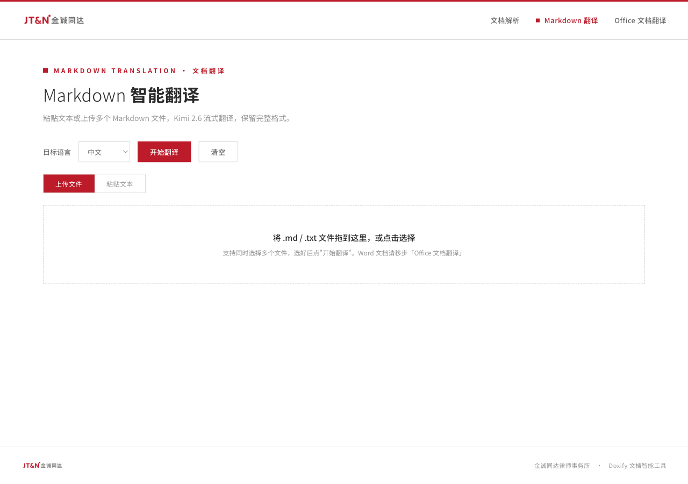
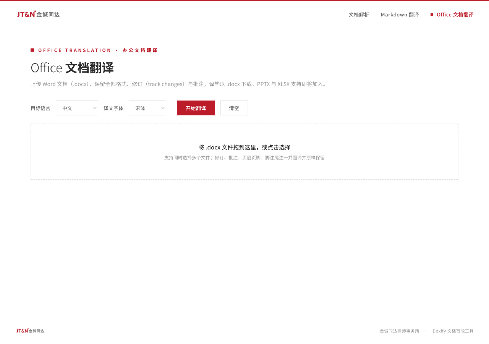

# DoxifySlim

基于 **GLM-5.3-Flash**（多模态 LLM）的 PDF→Markdown 解析 + Markdown / Office 文档翻译工具（JT&N 金诚同达内部使用）。任何 OpenAI 兼容的多模态端点都能接。
Doxify 的精简版：去掉了 MinerU / PaddleOCR-VL 等本地模型，只保留远程 VLM 路径，**无模型下载、无 GPU 依赖，Windows / macOS / Linux 通用**。

```
PDF ──→ GLM-5.3-Flash 逐页识别 ──→ Markdown（图表原样保留、脚注归一、跨页段落接回）
                                  │
Markdown ──→ 分块并行翻译 ──→ 译文 Markdown
                                  │
Word (.docx) ──→ 原位翻译 ──→ 译文 .docx（格式、修订、批注、字体全保留）
```

## 界面预览

| PDF 解析（`/`） | Markdown 翻译（`/translate`） | Office 文档翻译（`/office`） |
|---|---|---|
|  |  |  |

---

## 目录

- [功能](#功能)
- [安装](#安装)
  - [Windows](#windows)
  - [macOS / Linux](#macos--linux)
- [配置 `.env`](#配置-env)
- [启动与使用](#启动与使用)
  - [PDF 解析](#1-pdf-解析)
  - [Markdown 翻译](#2-markdown-翻译)
  - [Office 文档翻译](#3-office-文档翻译)
- [断线续跑与作业恢复](#断线续跑与作业恢复)
- [常见问题](#常见问题)
- [目录结构](#目录结构)
- [开发与测试](#开发与测试)

---

## 功能

### ① PDF 解析

- **引擎**：GLM-5.3-Flash（远程 OpenAI 兼容 API），PDF 每页转图片后逐页识别，多页并发
- **图表保留**：数字 PDF 里的位图和矢量图表自动抽出到 `images/`，Markdown 中原位引用；表格框线不会被误当成图片
- **后处理流水线**（对识别结果自动执行）：
  - 页眉页脚水印剥离（`Barcode:… / Filed By:…` 风格，含被模型加了包装的形态）
  - 脚注归一化：`^12^`、`¹²`、`<sup>12</sup>`、裸数字等畸形标记统一为 `[^12]`，尾注列表转为 `[^12]:` 定义
  - 跨页段落接回、段内硬换行接回、跨页表格接合
  - 页码兜底剥离、误标为引用块的列表还原、字面 `•` 转 Markdown 列表
- **思考模式防护**：按模型档案下发关闭思考的参数，并对响应做二次剥离，推理过程不会混进产物
- **页级缓存**：同一 PDF 重复解析零 API 调用（缓存键 = 文件内容 + DPI + 模型名）
- **多文件并行**，逐页实时进度，含图片时提供 ZIP 打包下载

### ② Markdown 翻译

- 粘贴文本或上传多个 `.md` / `.txt` 文件
- 分块并行、流式逐 token 输出；首段缓冲防止推理过程当译文流出
- 自动检测残留英文并一次性修正
- 保留 Markdown 格式、代码块、表格、链接

### ③ Office 文档翻译（目前支持 .docx）

- **格式、修订（track changes）、批注、页眉页脚、脚注尾注全部原样保留**——只改文本节点，文档结构一个节点不动
- 修订中的删除文本同样翻译，批注作者与时间戳不动
- **译文字体自动补齐**：英译中给汉字补东亚字体（宋体/等线/微软雅黑可选），中译英换拉丁字体，泰文走复杂文种轨；内置 8 种目标语言的常用字体，自定义语言由 LLM 即时推荐
- 未译成的段落会计数提示（"N 段未译，保留原文"），不静默

### 通用

- **作业在后台运行**：关掉浏览器标签、刷新页面、网络抖动都不会丢作业，重新打开页面自动接回进度
- 无认证，设计为本机 `127.0.0.1` 使用

---

## 安装

**前置条件**：

1. **Python 3.10 或更高版本**。除此之外不需要安装任何东西——没有模型下载，没有 GPU。
2. **能访问事务所私有化大模型网关**。网关部署在所内网，解析与翻译的每一次调用都要经过它：
   - 在办公室连所里的网络即可
   - **在所外（家里、出差、咖啡馆）必须先打开飞连并连上**，再启动或使用本工具；飞连断开，进行中的作业会因请求超时而失败

### Windows

1. **安装 Python**（已有 3.10+ 可跳过）
   - 从 [python.org](https://www.python.org/downloads/windows/) 或 [华为云镜像](https://mirrors.huaweicloud.com/python/) 下载安装包
   - 安装时**务必勾选 "Add python.exe to PATH"**
   - 装好后重新打开 PowerShell / 命令提示符，输入 `python --version` 确认

   > 如果 `python` 命令弹出微软商店，说明 PATH 里是商店占位程序。用 `py -3 --version` 试试；安装脚本会自动检测两种情况。

2. **获取代码**

   ```powershell
   git clone https://github.com/giantxu/DoxifySlim.git
   cd DoxifySlim
   ```
   没有 git 的话，在 GitHub 页面点 **Code → Download ZIP**，解压后进入目录。

3. **运行安装脚本**：双击 `install.bat`，或在该目录下的终端里执行

   ```powershell
   .\install.bat
   ```
   脚本会创建 `.venv` 虚拟环境、从国内镜像安装依赖（阿里云 → 清华 → 中科大自动回退），并生成 `.env`。

4. **填写 `.env`**（见下节），用记事本打开即可。

5. **启动**：双击 `start.bat`。浏览器会自动打开 `http://127.0.0.1:4000`。

### macOS / Linux

```bash
git clone https://github.com/giantxu/DoxifySlim.git
cd DoxifySlim
bash install.sh          # 创建 .venv、安装依赖、生成 .env
# 编辑 .env 填写 API 信息
bash start.sh            # 启动服务
```

### 手动安装（任意平台）

不想用脚本的话：

```bash
python -m venv .venv
# Windows:  .venv\Scripts\activate
# macOS/Linux:  source .venv/bin/activate
pip install -r requirements.txt -i https://mirrors.aliyun.com/pypi/simple
cp .env.example .env     # Windows 用 copy
python app.py
```

---

## 配置 `.env`

安装脚本会从 `.env.example` 复制一份 `.env`。**必须填写的只有三项**：

```ini
TARGET_API_URL=http://你的网关地址/v1/chat/completions   # OpenAI 兼容端点
TARGET_API_KEY=你的密钥
ACTUAL_MODEL_NAME=GLM-5.3-Flash                            # 网关上的模型名
```

**第四项强烈建议确认**——它决定"关闭思考模式"用哪套参数，选错的后果是模型的推理过程整段写进产物：

```ini
LLM_PROFILE=glm53flash    # GLM-5.3-Flash → glm53flash；Kimi / Qwen 系 → kimi26
```

其余参数都有合理默认值，`.env.example` 里每一项都有注释说明。常用的几个：

| 变量 | 默认 | 说明 |
|---|---|---|
| `GATEWAY_PORT` | 4000 | 服务端口 |
| `PDF_DPI` | 200 | PDF 转图片分辨率。**改动会让页缓存全部失效** |
| `CONCURRENCY` | 5 | 单文件内并发页数 |
| `MAX_CONCURRENT_REQUESTS` | 8 | 全局同时 API 请求上限 |
| `TRANSLATE_CONCURRENCY` | 3 | 同时在途的翻译流数 |
| `TRANSLATE_TARGET_LANG` | 中文 | 默认目标语言 |
| `HEARTBEAT_SEC` | 60 | 进度心跳日志间隔，`<=0` 关闭 |

---

## 启动与使用

> **先确认网络**：不在所内网时，启动前打开飞连。否则页面能打开，但一上传文件就会卡在"排队中"或报超时。

| 平台 | 启动 | 停止 |
|---|---|---|
| Windows | 双击 `start.bat` | 在黑窗口按 `Ctrl+C`，或直接关窗口 |
| macOS / Linux | `bash start.sh` | `Ctrl+C` |

启动后三个页面：

| 页面 | 地址 |
|---|---|
| PDF 解析 | `http://127.0.0.1:4000/` |
| Markdown 翻译 | `http://127.0.0.1:4000/translate` |
| Office 文档翻译 | `http://127.0.0.1:4000/office` |

日志写在 `gateway.log`（与 `app.py` 同目录），排查问题先看它。

### 1. PDF 解析

1. 打开首页，按需勾选处理选项：
   - **去除页眉/页脚水印**：剥离 `Barcode:… / Filed By:…` 这类行（默认开）
   - **插入分页标识**：每页之间插 `--- [第 N 页] ---`（默认开）。**取消勾选**时程序才会执行跨页段落接回、跨页表格接合——想要连贯的正文就把它关掉
   - **规范化脚注/尾注**：畸形脚注标记统一为 Markdown 语法（默认开）
2. 把 PDF 拖进上传区（可多选）——**拖入即开始**，没有"开始"按钮
3. 每个文件一张卡片，实时显示 `已完成/总页数`
4. 完成后：**复制 Markdown**、**下载 .md**；如果文档含图表，还会出现 **下载 ZIP（含图片）**——`.md` 里的图片引用是相对路径 `images/…`，解压后放在一起即可正常显示

> 同一份 PDF 再次解析会命中页缓存，几乎瞬间完成、不消耗 API。

### 2. Markdown 翻译

1. 打开 `/translate`，选目标语言（中文 / English / 日本語 / 自定义）
2. 两种输入：
   - **粘贴文本**：左边贴原文，右边实时出译文
   - **上传文件**：拖入多个 `.md` / `.txt`，每个文件一张卡片
3. 点 **开始翻译**。分块并行，逐 token 流式显示
4. 完成后复制或下载 `.md`；文件名自动带语种后缀（如 `报告_EN2CN.md`）

### 3. Office 文档翻译

1. 打开 `/office`，选目标语言。内置：中文、English、日本語、葡萄牙语、西班牙语、越南语、泰语、马来西亚语，或选**自定义**输入任意语言名
2. **译文字体**下拉会随语言变化，列出该语言 Word 文书最常用的字体；自定义语言输入后约 1 秒，程序会向 LLM 询问并刷新字体列表。不想动字体选 **不调整**
3. 拖入 `.docx`（可多选），点 **开始翻译**
4. 完成后点 **下载 .docx**。产物保留原文档的全部格式、修订、批注；如有段落未能译成，状态会显示"完成（N 段未译，保留原文）"

> 修订（track changes）中被删除的文字也会翻译，修订标记原样保留——读者能看懂完整的修改历史。

---

## 断线续跑与作业恢复

所有解析和翻译都是**后台作业**，与浏览器连接无关：

- 关掉标签页再打开、刷新、电脑休眠后唤醒、网络抖动——页面会自动接回正在进行的作业，进度从上次位置继续显示
- 想中止就点卡片上的 **取消**
- 服务重启后作业会丢（在内存里），但 PDF 解析的**每一页结果都已经落盘**：重新上传同一份 PDF，已完成的页直接从缓存读取，只补跑没做完的页

---

## 常见问题

**Q: 产物里出现了模型的"思考过程"（一大段"用户希望我…让我来…"）？**
`LLM_PROFILE` 与网关背后的真实模型不匹配。GLM-5.3-Flash 填 `glm53flash`，Kimi / Qwen 系填 `kimi26`，改完重启。程序还有一道事后剥离，但选对档案才是根治。

**Q: 页面能打开，但上传后一直"排队中"，或者卡片报超时 / 失败？**
九成是连不上大模型网关。网关在所内网，所外使用**必须开飞连**。检查：飞连是否已连接、`.env` 里 `TARGET_API_URL` 是否正确；`gateway.log` 里会有 `连接超时` / `502` 之类的记录。开好飞连后重新上传即可，页缓存会让已完成的页秒过。

**Q: Windows 上中文显示乱码 / 报 `UnicodeDecodeError`？**
请用 `start.bat` 启动（它设置了 UTF-8 环境）。手动启动的话先执行 `set PYTHONUTF8=1`。

**Q: `install.bat` 说找不到 Python，但我装了？**
安装时没勾 "Add python.exe to PATH"。重新运行 Python 安装包，选 Modify，勾上 PATH；或者用 `py -3` 启动器（脚本会自动尝试）。

**Q: pip 安装依赖失败？**
脚本会依次尝试三个国内镜像。都失败多半是代理/防火墙问题——关掉代理软件再试，或手动指定镜像：`pip install -r requirements.txt -i https://mirrors.aliyun.com/pypi/simple`。

**Q: 解析结果里表格是 HTML 而不是 Markdown？**
含合并单元格的表格 Markdown 语法表达不了，程序会保留 HTML（在 Obsidian、Typora 等渲染器里能正常显示）。不含合并单元格的表会自动转成 Markdown 管道表。

**Q: 改了 `PDF_DPI` 之后为什么之前的文档要重新识别？**
DPI 是页缓存键的一部分——分辨率变了识别结果就可能不同，缓存必须失效。

**Q: 能多人共用吗？**
可以把 `app.py` 里的 `host="127.0.0.1"` 改成 `0.0.0.0`，局域网内通过 `http://<本机IP>:4000` 访问。但程序**没有认证**，不要暴露到公网。

---

## 目录结构

```
DoxifySlim/
├── app.py               # 主程序（FastAPI，单文件）
├── llm_common.py        # 模型档案与响应清洗
├── seed_page_cache.py   # 工具：从浏览器抢救的 JSON 回填页缓存
├── static/              # 前端静态资源（重连逻辑 job-client.js、logo）
├── tests/               # pytest 测试
├── docs/images/         # README 截图
├── requirements.txt
├── .env.example         # 配置样例（复制为 .env）
├── install.bat / install.sh
├── start.bat / start.sh
├── output/              # 运行时产物（自动创建，已 gitignore）
└── gateway.log          # 运行日志（自动创建）
```

## 开发与测试

```bash
# 激活 venv 后
python -m pytest tests/ -q
```

测试不需要网络、不需要 API 密钥（LLM 调用全部用伪造客户端），几秒跑完。`tests/conftest.py` 会把日志重定向到临时文件，不污染 `gateway.log`。

架构说明见 `CLAUDE.md`。

## 许可

MIT，见 `LICENSE`。
